# Project Submission (Report):
---

### **1. Test Code Coverage**

* **Test Code Coverage:**
* **Status:** 100% (Target: >60%)
* **Tests:** Includes positive/negative tests for User, Cart, and Order controllers.
* **Evidence:**
> **[SCREENSHOT]**

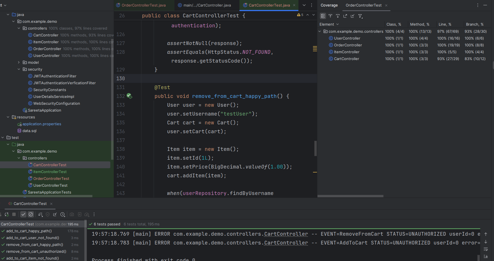

you can file the full report in [here](/starter_code/htmlReport/index.html)

---

### **2. Metrics, Dashboards, and Alerts**

* **Logging Strategy:**
* Structured logs implemented for (Event): `AddToCart`, `RemoveFromCart`, `FinishOrder`, `GetOrder`, and `CreateUser`.
* Status: `SUCCESS`, `FAILURE`, `UNAUTHORIZED`.

* **Splunk Integration:**
* **Dashboard:** Visualizes logs data and ability to filter.
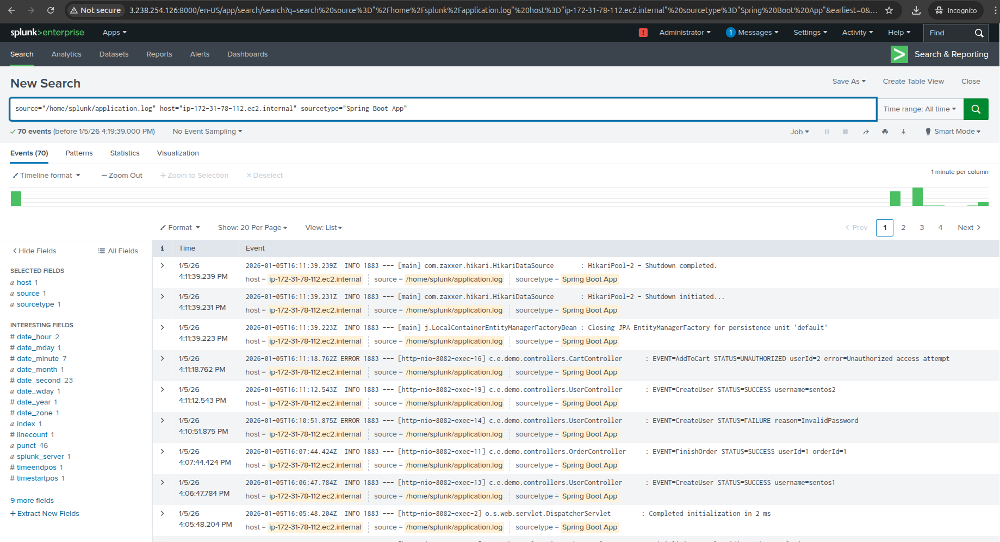
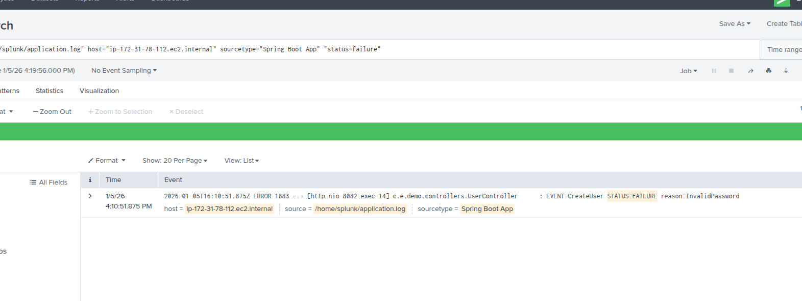

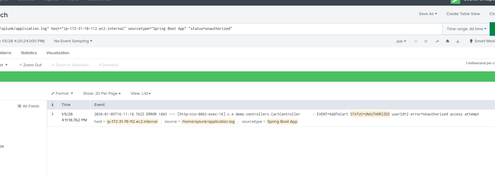

* **Alert:** Configured to trigger on Unauthorized Status.
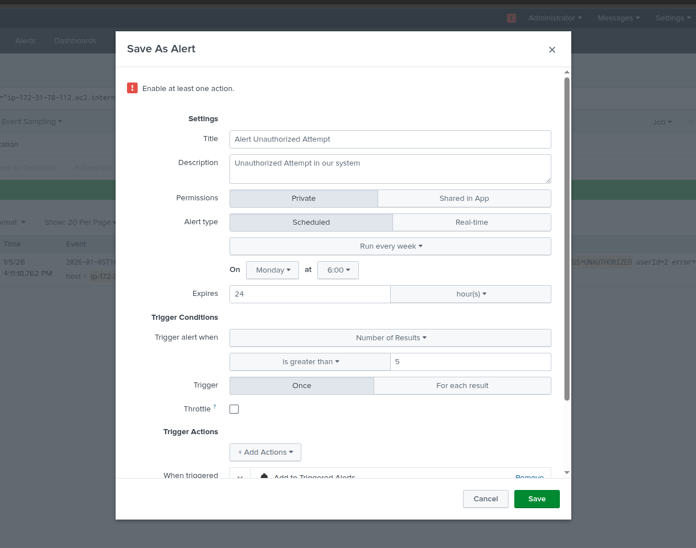
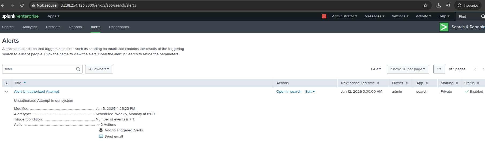

---

### **3. CI/CD (Jenkins)**

* **Pipeline Automation:**
* Automated the `Build`, `Test` and `Deployment` using Jenkins.
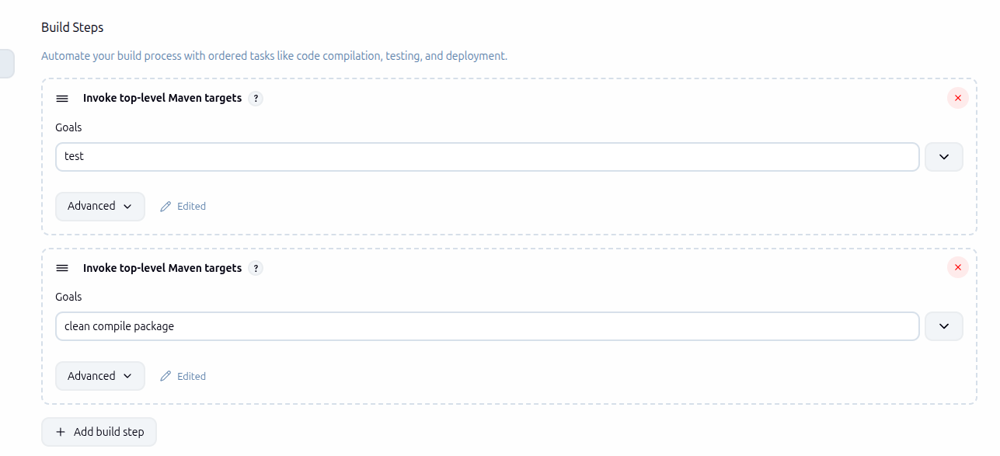

* **Status:** Build passes successfully.
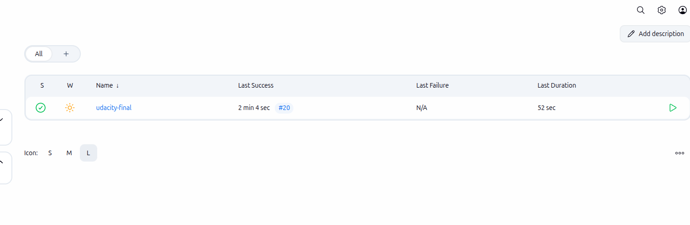
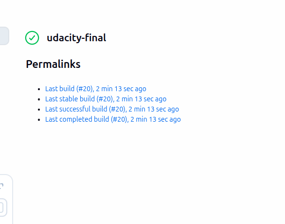
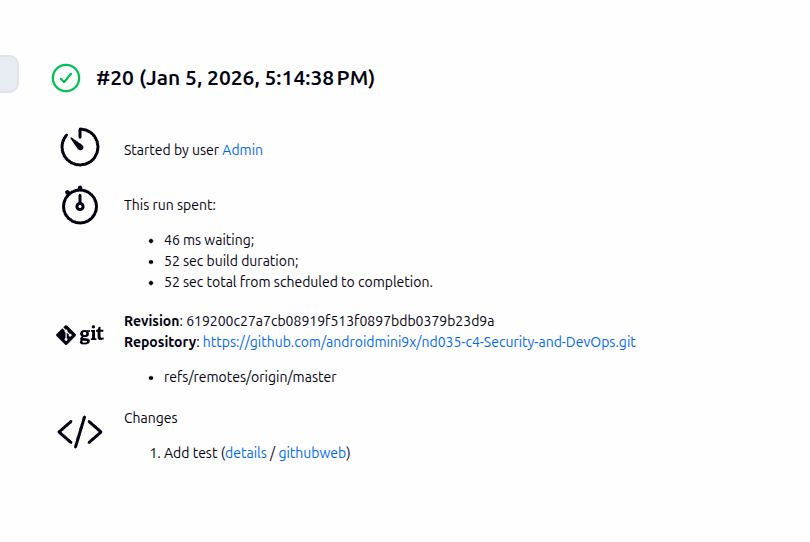
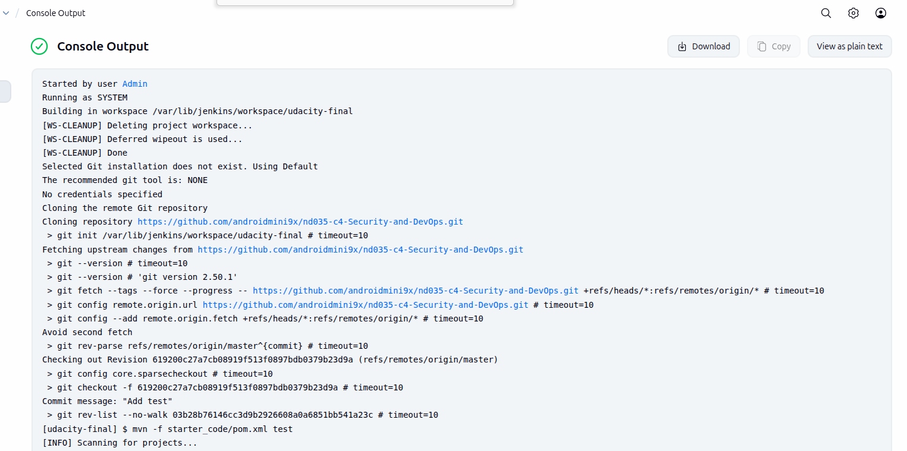
You can see the full logs report for the process [here](ci_ci_log.txt)